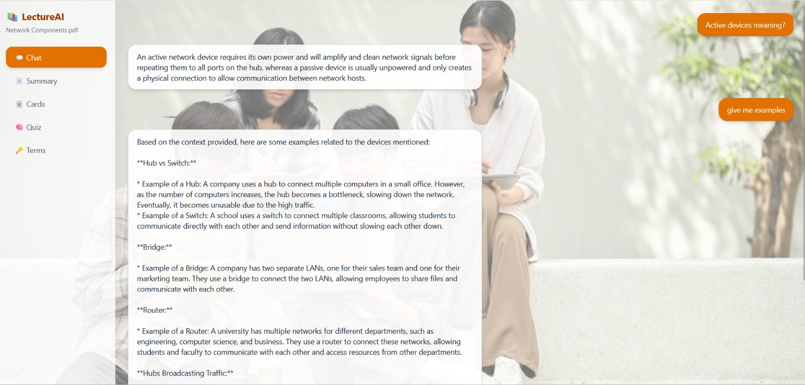
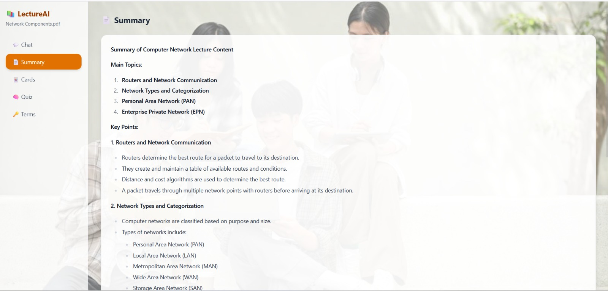
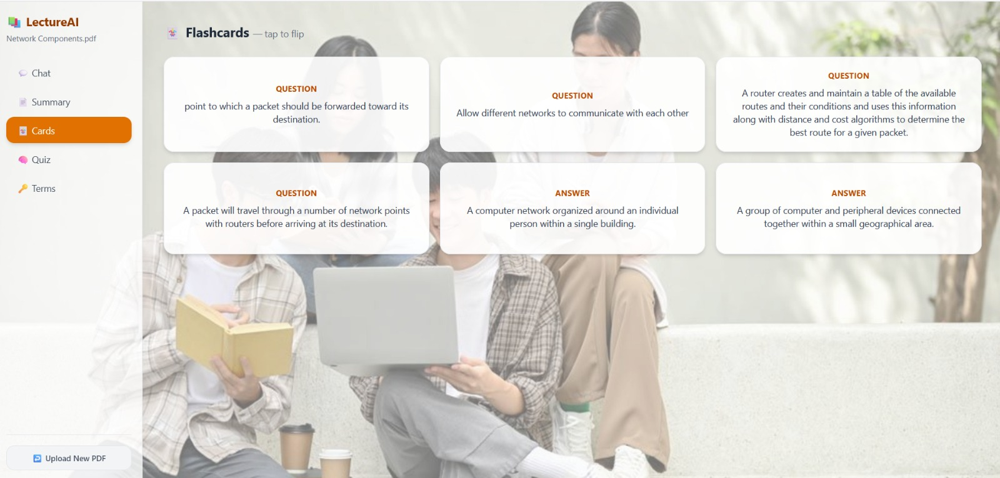
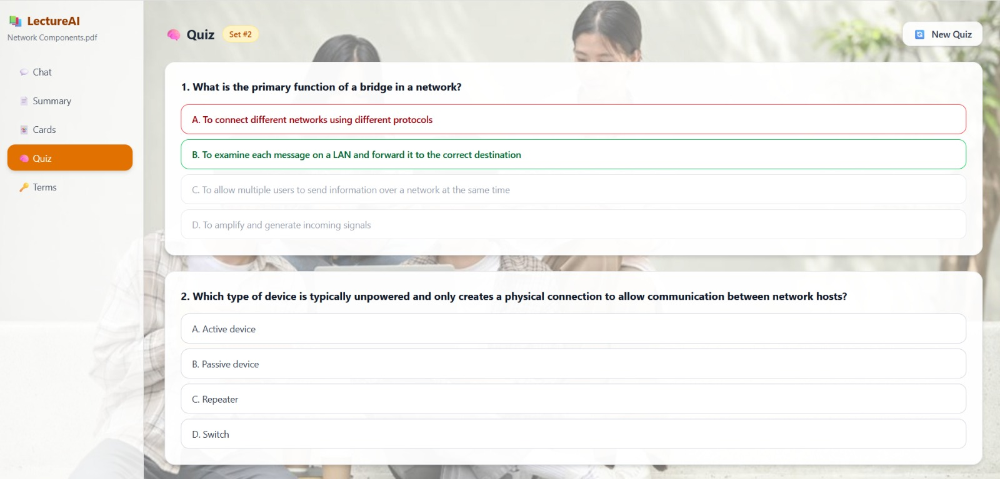
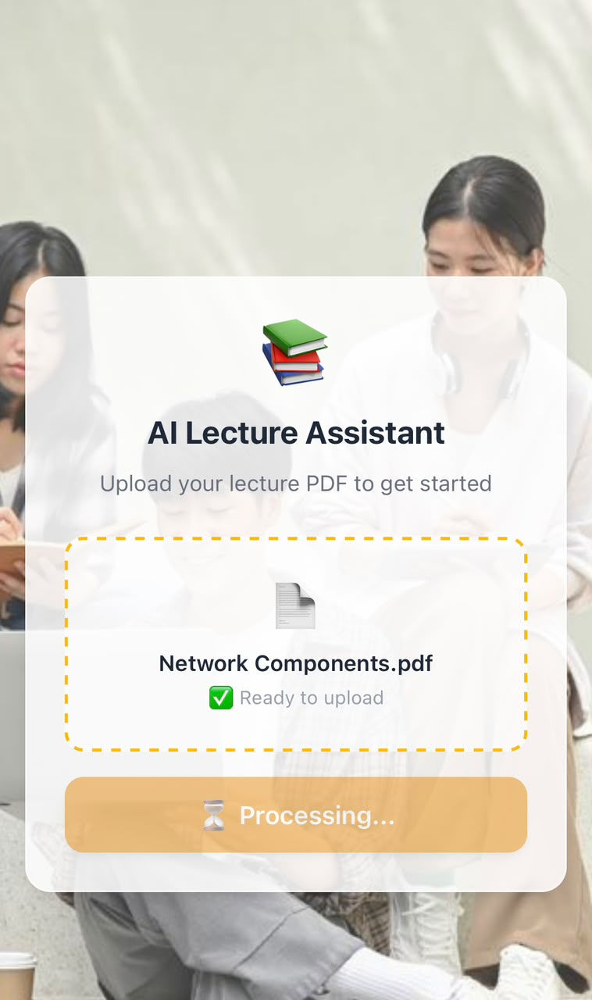
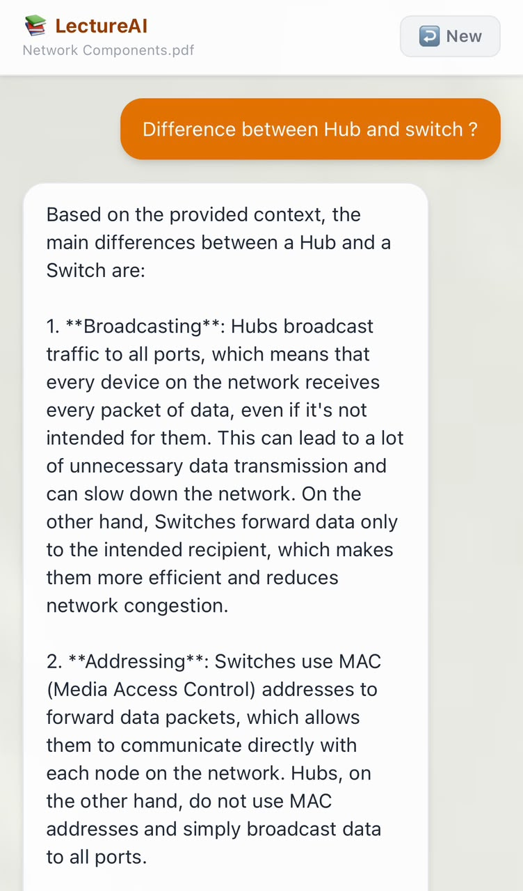
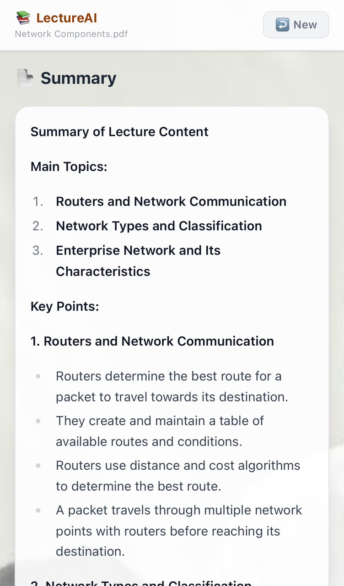
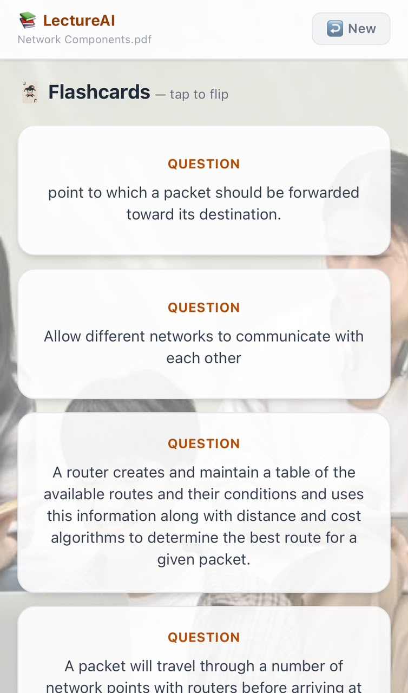
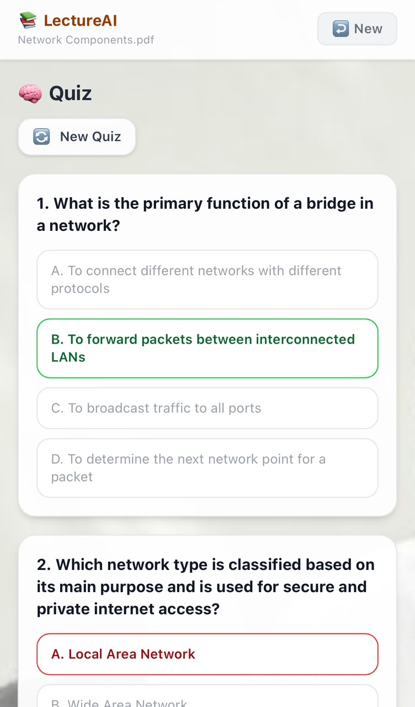
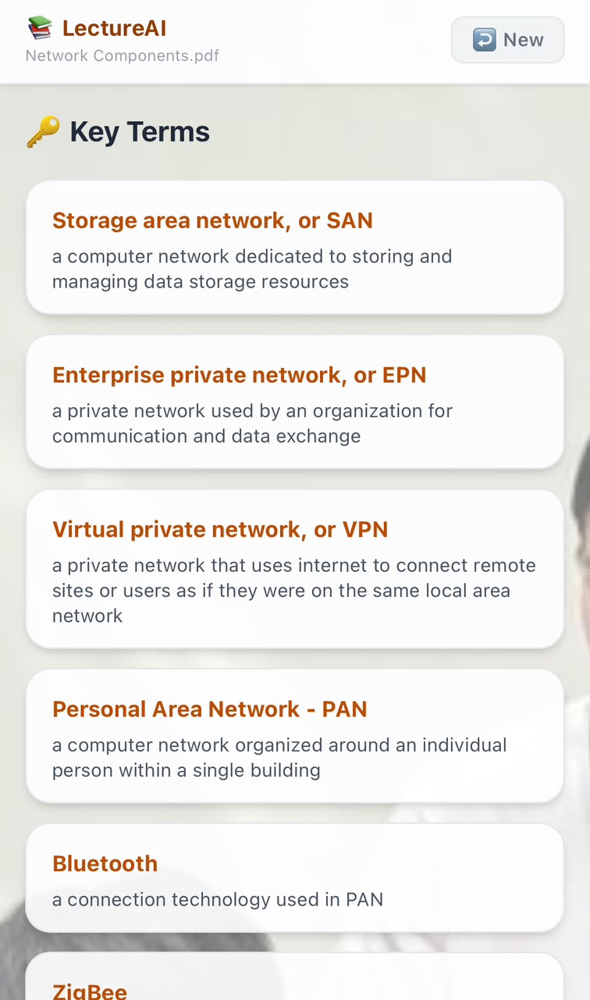

# 📚 LectureAI Study Assistant

An AI-powered study companion that turns your lecture PDFs into chat Q&A, summaries, flashcards, quizzes, and key term glossaries — built with FastAPI, LangChain, ChromaDB, and Groq's LLaMA 3.1.

🔗 **Live demo:** [lecture-ai-assistant.vercel.app](https://lecture-ai-assistant.vercel.app)

---

## ✨ Features

- 💬 **Chat Q&A** — ask anything about your lecture, answered via RAG over the PDF content
- 📄 **Summary** — auto-generated concise overview of the document
- 🃏 **Flashcards** — tap-to-flip cards for quick revision
- 🧠 **Quiz** — auto-generated multiple-choice quizzes, regenerate for new sets
- 🔑 **Key Terms** — extracted glossary of important terms and definitions
- 📱 **Fully responsive** — sidebar navigation on desktop, bottom tab bar on mobile

---

## 🖥️ Desktop view

<table>
<tr>
<td></td>
<td></td>
<td></td>
</tr>
<tr>
<td></td>
<td></td>
<td></td>
</tr>
</table>

---

## 📱 Mobile view

<table>
<tr>
<td></td>
<td></td>
<td></td>
</tr>
<tr>
<td></td>
<td></td>
<td></td>
</tr>
</table>

---

## 🛠️ Tech stack

**Backend**
- FastAPI
- LangChain (LCEL)
- ChromaDB (vector store)
- HuggingFace Embeddings (`all-MiniLM-L6-v2`)
- Groq — LLaMA 3.1

**Frontend**
- React + Vite
- TailwindCSS
- Axios

**Deployment**
- Backend: Hugging Face Spaces
- Frontend: Vercel
- Uptime monitoring: UptimeRobot

---

## 🚀 Getting started

### Backend

```bash
cd backend
pip install -r requirements.txt
uvicorn main:app --reload
```

Set environment variables:
```
GROQ_API_KEY=your_groq_api_key
```

### Frontend

```bash
cd frontend
npm install
npm run dev
```

Set environment variables in `.env`:
```
VITE_API_URL=http://localhost:8000
```

---

## 👤 Author

**Vimansa Siyasinghe**
3rd-year BSc (Hons) Software Engineering — NSBM Green University

[LinkedIn](https://www.linkedin.com/in/vimansa-siyasinghe-1b74103a8) · [GitHub](https://github.com/Vimansa-Siyasing)
